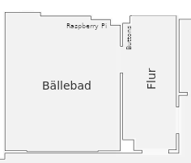

# ButtonCtl
<div style="text-align:center"></div>

### dependencies
- RPi python3-rpi.gpio
```bash
sudo apt install python3-rpi-gpio
```
- OpenSSH client
```bash
sudo apt install openssh
```
- circuitpython libraries for neopixel
```bash
pip3 install adafruit-circuitpython-neopixel
```

### install
```bash
git clone https://github.com/dylangoepel/buttonctl.git
cd buttonctl
./service.sh # create systemd .service file
sudo systemctl enable buttond # autostart at boot
sudo systemctl start buttond # start as daemon
```

### wiring
- pin 23: left button input (pull-down)
- pin 24: center button input (pull-down)
- pin 22: right button input (pull-down)
- pin 18: neopixel data
- pin 4: (pull-down)


- led strip:
```
(25-36)  (13-24)  (1-12)
 AERIE            KELLER

 (counter-clockwise)
```

### usage


→ Linker Button


 
→ Mittlerer Button


→ Kurze Wartezeit


 

----------


→ Linker Button


 
→ Linker Button


-----------


→ Mittlerer Button


